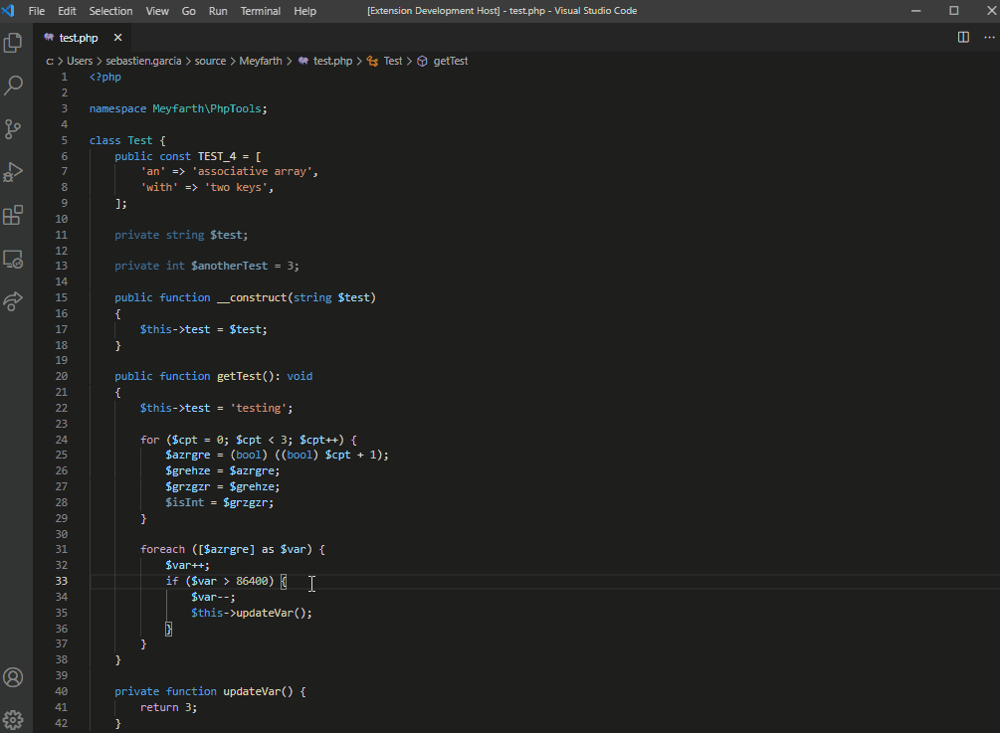
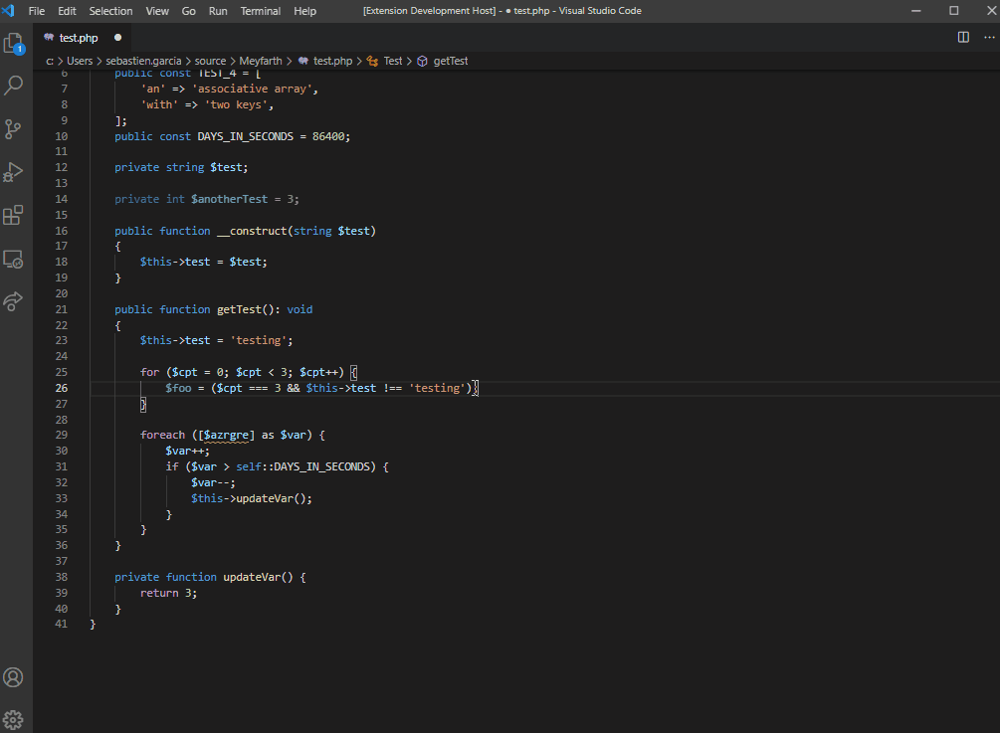

# php-tools README

Php-tools is an extension that includes some features related to php development.

## Features

### Extract code

Extract constants

Extract variables

Or even methods

TODO code :sweat-smile:

## Requirements

A php file

## Extension Settings

N/A for now

What's next into the configuration:
- Configure default visibility for extracting methods and constants
- Typehint new property

For example:

This extension contributes the following settings:

* `myExtension.enable`: enable/disable this extension
* `myExtension.thing`: set to `blah` to do something

## Known Issues

Alpha version, what do you expect?

## What's next:
- Extract method
- Add several occurences to extraction
- Add constant to the file (without moving the cursor)
- Add property + constructor
- Generate getters and/or setters
- Add constructor property (can use the 'Add php property' plugin for now)
- Flip properties inside a method call or signature
- Toggle context menu with all those options
- Toggle context menu contextualized (depending on cursor position)
- Generate namespaced php file
